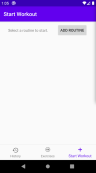
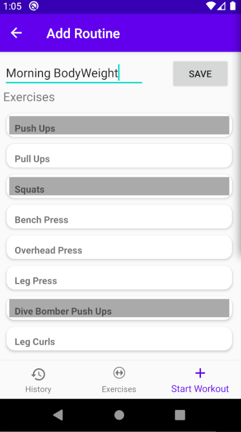
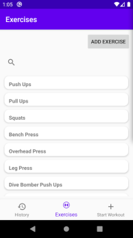
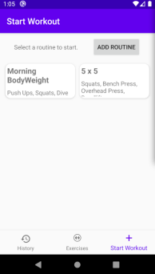
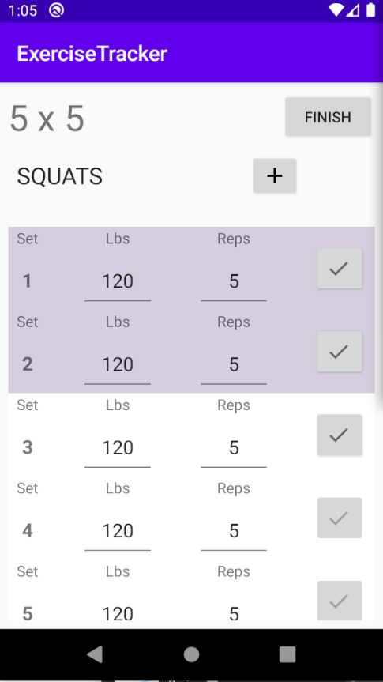
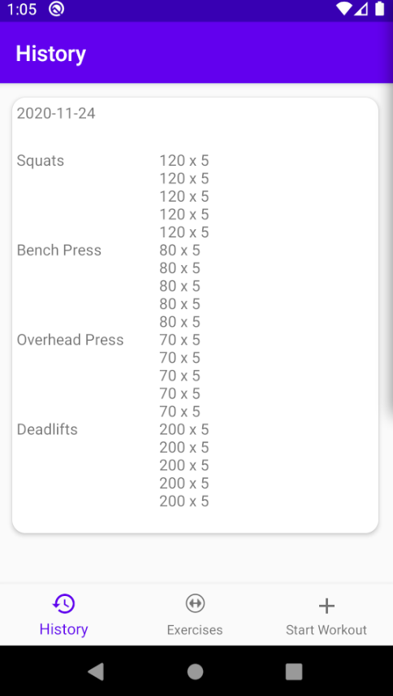

# ExerciseTracker
Kotlin app for tracking exercise sessions.

I made this app to get practice using Android Architecture Components and to help keep track of my own fitness efforts at home.

## Installation
You can install the app by running it in Android Studio and installing to a local device or an emulator.

https://developer.android.com/studio/run/emulator

## Using the app
|Instructions                                             |                                                                                |
|---------------------------------------------------------|:------------------------------------------------------------------------------:|
|You start at a screen for selecting a routine to perform.||
|Hit the Add Routine button to create a new routine.      |       |
|Go to the Excercises tab to see all the exercises and add new ones.|  |
|Once you have created a routine, select it to start working out!||
|Track your weights used and sets while you work out.     ||     
|See your workout history on the history tab.             |     |
